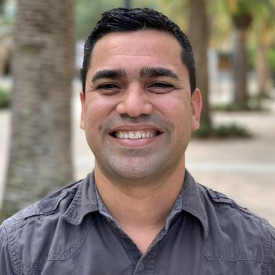

  
  

    <h1 style="margin: 0;">Yadel Lopez</h1>
    <h3 style="margin: 5px 0; color: #666;">Software Engineer & Distributed Systems Architect</h3>
    

      📍 Naples, FL 
      📞 (239) 378-3633 
      📧 <a href="mailto:yadel.lopez@eblsoftware.com">yadel.lopez@eblsoftware.com</a> 
      🔗 <a href="https://linkedin.com/in/dotnetspark" target="_blank">LinkedIn</a> | 
      💻 <a href="https://github.com/dotnetspark" target="_blank">GitHub</a>
    

  

---

## SUMMARY

Software Engineer and Distributed Systems Architect with 15+ years of experience designing fault-tolerant, multi-tenant cloud-native solutions with ASP.NET, Service Fabric, RabbitMQ, Redis, MongoDB, and Azure SQL. Proven leadership in driving observability-first with Prometheus and Grafana and platform resiliency enforcing SLA boundaries. Passionate about operational excellence, AI-driven architecture, and cloud-native scalability. Track record of delivering multimillion-dollar impact, mentoring high-performance teams, and leading technical initiatives in both public and enterprise environments.

---

## TECHNICAL SUMMARY

**Languages:** C#, PowerShell, JavaScript, TypeScript, T-SQL, PL-SQL  
**Observability:** Kusto, Splunk, Grafana, Azure App Insights, Azure Data Factory, Power BI  
**Web:** ASP.NET (MVC/Core), Minimal API, OpenAPI, Node.js, React, Blazor  
**Testing & Automation:** Moq, xUnit, Selenium, Azure DevOps, GitHub Actions  
**Architecture & Principles:** Clean Architecture, DDD, TDD, Event-Driven Architecture, Microservices, SOLID, Redis, RabbitMQ, Polly, Docker, Service Fabric  
**Data & Reporting:** Azure SQL Server, MS SQL Server, Oracle, MongoDB, SSIS, SSRS  
**Security:** OAuth, OpenIdConnect, SSO, Duende BFF, Azure B2C, Okta, IBM AppScan

---

## EXPERIENCE

### Senior Fullstack Engineer — EBL Software LLC (Remote)

_Jan 2025 – Present_

- Built a HIPAA-compliant backend for a veterinary medical data extraction platform leveraging FastAPI, Celery, PostgreSQL, and Redis.
- Designed and implemented asynchronous task processing and caching for LLM-powered transcript extraction, enabling scalable and efficient workflows.
- Developed secure data models and schemas to store transcripts, extraction results (raw and sanitized), and task statuses, supporting auditability and compliance.
- Integrated a React frontend with real-time task polling, error handling, and dynamic result rendering.
- Enforced strict privacy and logging practices to prevent PHI exposure.
- Automated database initialization and migration for streamlined deployment.

**Tech Stack:** Python, FastAPI, Celery, PostgreSQL, Redis, SQLAlchemy, Docker, React, TypeScript, Material UI, Git

---

### Senior Software Engineer — Microsoft Corporation – Cloud + AI (Remote)

_May 2022 – Dec 2024_

- Developed globally distributed, multi-tenant cloud-native services in Azure SQL for SharePoint and OneDrive workloads, including a new SLO and enabling seamless migration, reducing COGS by $32M annually.
- Engineered scalable APIs and workflows using C#, Service Fabric, and ASP.NET Core for high-availability systems.
- Implemented observability-first practices and collaborated with cross-functional teams on KPI reviews.
- Delivered operational excellence managing large-scale distributed systems with strict SLAs.
- Led root cause analyses for major incidents, driving systemic improvements.

**Tech Stack:** C++, .NET (C#), ASP.NET Core, SQL Server, Kusto, PowerShell, Azure DevOps, Docker, Service Fabric, Swagger

---

### Principal Software Engineer — OneStream Software (Remote)

_May 2021 – Feb 2022_

- Led migration of the Core FX platform from WPF to Blazor Server, improving load times and UX.
- Implemented secure SSO with Okta using OAuth 2.0, OpenID Connect, and Duende BFF.
- Leveraged Backend-for-Frontend (BFF) for secure token handling, reducing XSS risk.
- Partnered with architects and peers on POCs and best practice adoption.

**Tech Stack:** .NET (C#), Blazor, ASP.NET Core, SQL Server, Duende BFF, Okta, Swagger, JavaScript

---

### Software Engineer II — UKG (Ultimate Kronos Group) (Remote)

_Sep 2019 – May 2021_

- Architected bounded contexts and domain services in the UltiPro Tax Engine to improve modularity.
- Modeled tax computation aggregates ensuring auditability and rule consistency.
- Developed DDD-aligned APIs enabling seamless domain integration.
- Built Grafana dashboards and embedded telemetry for operational insights.

**Tech Stack:** ASP.NET Core (C#), MongoDB, RabbitMQ, Swagger, xUnit, Selenium, Grafana, DDD, TDD

---

### Software Architect — Miami-Dade County (Miami, FL)

_Jul 2013 – Aug 2019_

- Architected the GoldKey solution (SOLID & Clean Architecture) — processing time improved by 90%, accuracy increased, customer satisfaction boosted.
- Built web apps and APIs for multiple departments using ASP.NET MVC, Web APIs, MS SQL Server, Oracle.
- Integrated CI/CD pipelines with Azure DevOps and IBM AppScan.
- Led observability implementations and ensured comprehensive test coverage.

**Tech Stack:** .NET Core, ASP.NET MVC (C#), SQL Server, Oracle, Power BI, SSIS, Swagger, Azure DevOps, Splunk, Moq

---

## EDUCATION

**B.S. Information Technology** — Camilo Cienfuegos University, Cuba _(July 2010)_
